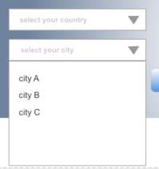

点击[__这里__](https://ssdna.github.io/ife-practice/experimental/task05/index.html)查看最终实现的页面效果.

- [ ] 下拉菜单
- [X] 轮显Banner
- [ ] Tab切换
- [ ] Select联动

## 编码学习

基于之前的HTML任务，完成以下交互功能

1. 下拉菜单

用两种方案实现如下图的下拉菜单，方案分别为使用JavaScript和不使用JavaScript

子菜单项数量及内容任意填写，不作要求。

下拉菜单的样式可参考上图，但不做强制的一致性要求，样式接近即可

__交互方式__：

> 鼠标滑过（hover）一级菜单时，便弹出二级菜单，鼠标滑出hover的一级菜单及二级菜单后，二级菜单消失。

2. 轮显Banner

如上图，自行寻找3-4张图片作为轮流显示的Banner图片，按照一定的时间（如2秒，可灵活配置），进行轮流显示.

显示的动画实现两种效果，一种是淡入淡出，一种是左（或右）移动切换.

banner下部的线代表当前轮流显示到哪张图，和图片轮显同步变更。

3. Tab切换

点击tab，进行tab选中状态的切换，并更新tab下的内容

下方内容自定义，不作具体要求。

4. 实现自定义样式下拉菜单Select并实现联动

实现如上图的下拉菜单样式，交互与系统默认的Select保持一致

__联动__：

上面的下拉菜单选择会影响下面下拉菜单的可选项，Select中的选项自定义，不做要求。

> 例如：
> 
> 上面选项是 无，中国，美国，英国
> 
> 则对应下面选项为：
> 
> 无：无
> 
> 中国：北京、上海、广州
> 
> 美国：洛杉矶、纽约、旧金山
> 
> 英国：伦敦、利物浦、曼彻斯特

以上任务代码放在Github或codepen等上

## 阅读练习

JavaScript编码规范
