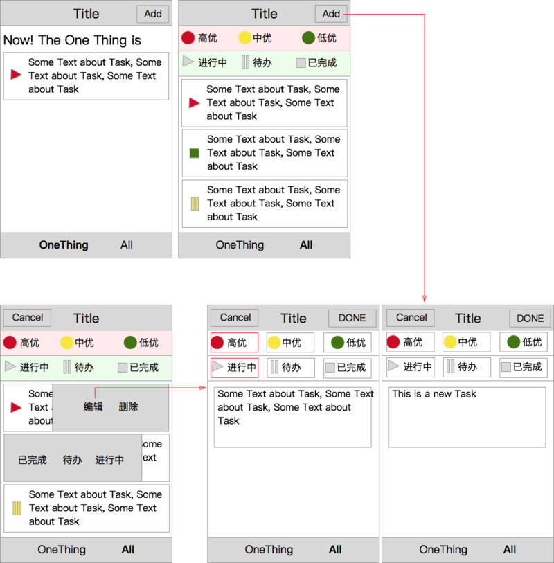

点击[__这里__](https://ssdna.github.io/ife-practice/experimental/task12/index.html)查看最终实现的页面效果（需要在chrome-devtool里调成手机模式）。

## 任务描述

实现一个简单的todo管理的移动Web工具，如下设计图：

### 任务要求

1. 使用ES6，Webpack，LESS完成需求
2. 可以使用JQuery、Zepto、Hammer等基础库组件，但不允许使用react, vue等框架
3. 样式方面上图仅为示意图，不需要严格按照图去实现样式，可以使用bootstrap等样式库
4. 每个todo管理的任务有以下属性：任务内容、任务优先级（高中低），任务状态（待办、进行中、已完成）
5. 对于每个任务有如下操作：新增，编辑，删除
6. 在任务列表中，对每个任务进行向右滑动的手势，会从左到右滑入一个灰色块，上面有已完成，待办，进行中三个状态选择，可以直接更改状态
7. 在任务列表中，对每个任务进行向左滑动的手势，会从右到左滑入一个灰色块，上面有编辑和删除两个按钮，点击删除，直接从列表中删除，点击编辑，进入编辑界面。
8. 设计一个数据结构存储todo数据，数据存储在localStorage中
9. 下方菜单有两个选项，OneThing和ALL，OneThing显示最早添加的一个高优进行中的需求
10. ALL界面上方有优先级和任务状态的筛选按钮，点击后进行下面任务列表的筛选。筛选按钮均可多选
11. JS和CSS文件安装业务模块逻辑尽量拆分得细粒度
